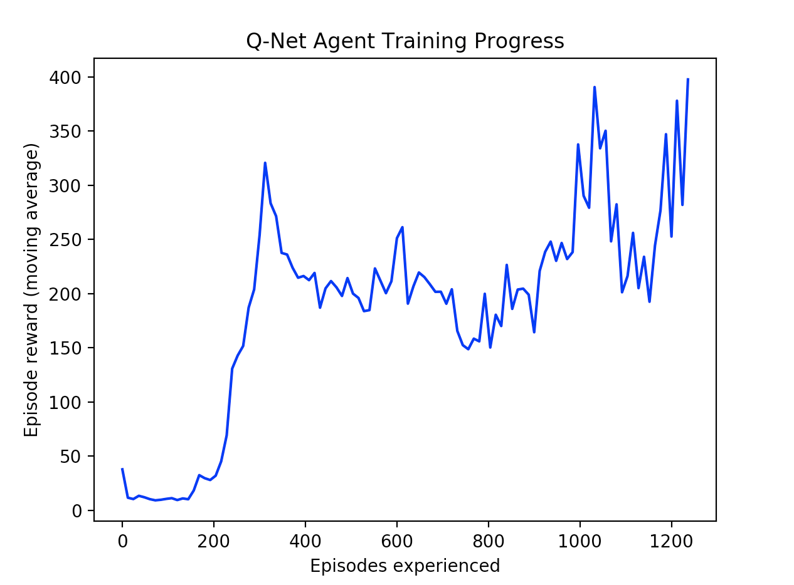

# TensorFlow 2.0 Playground

I'm writing some code with TF 2.0 to familiarize myself with the framework since its eager-execution paradigm is totally different from TF 1.0 which I have some experience with. Might move some of these files to other repositories later, idk.

## DQN Algorithm Implementation
The file `cartpole_dqn.py` contains my implementation of the [DQN algorithm](https://www.cs.toronto.edu/~vmnih/docs/dqn.pdf), applied to the CartPole-v1 Gym environment, with an experience replay buffer and a frozen target network to stabilize training.

